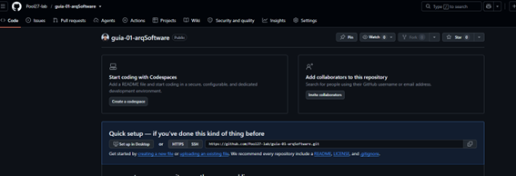
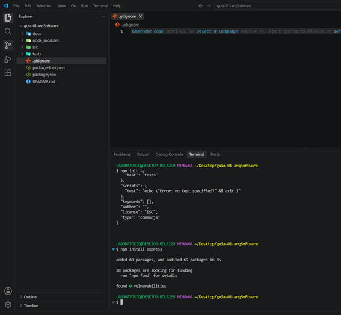

# Laboratorio 01 - Arquitectura de Software

## 👨‍🎓 Datos del estudiante

**Alumno:** Jhair Pool Ccenhua Delgado

**Curso:** Arquitectura de Software

**Docente:** LIZBETH JAICO QUISPE

## 📚 Descripción del curso

El curso de Arquitectura de Software permite comprender los principios, patrones y buenas prácticas utilizados para diseñar sistemas de software mantenibles, escalables y organizados.

Durante el curso se desarrollarán actividades prácticas relacionadas con arquitectura de software, diseño de sistemas, documentación, control de versiones y trabajo colaborativo.

## 🎯 Expectativas del curso

Mis expectativas respecto al curso son fortalecer mis conocimientos sobre arquitectura de software y aprender a diseñar sistemas de manera estructurada.

También espero mejorar mis habilidades en el uso de herramientas como Git, GitHub, Node.js y otras tecnologías utilizadas para el desarrollo de software.

## 📸 Evidencias del laboratorio

### Paso 01 - Creación del repositorio

Aquí se agregará la captura correspondiente al Paso 01.

### Paso 02 - Creación de la estructura del proyecto

Aquí se agregará la captura correspondiente al Paso 02.

